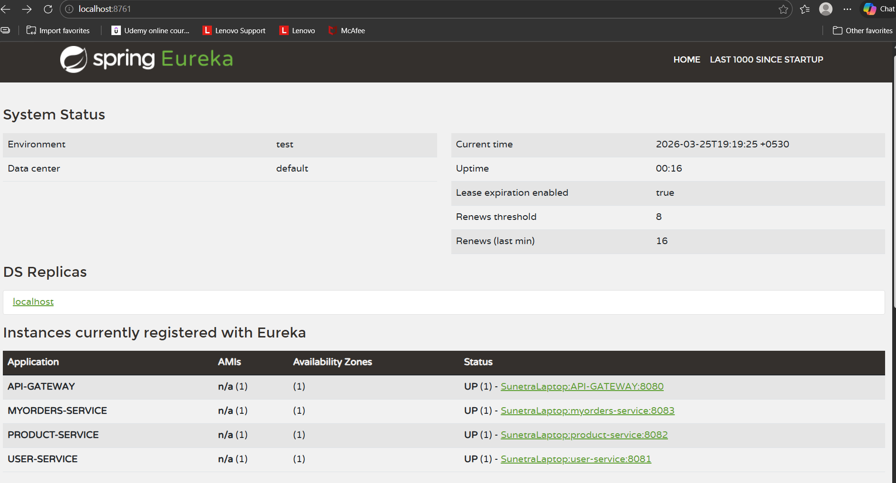
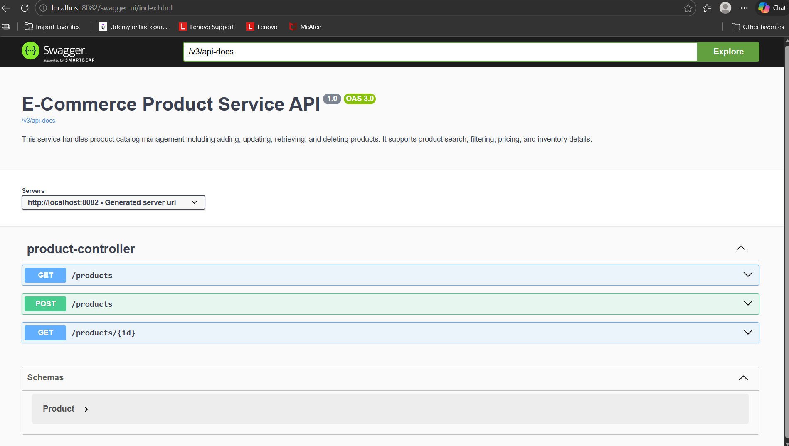
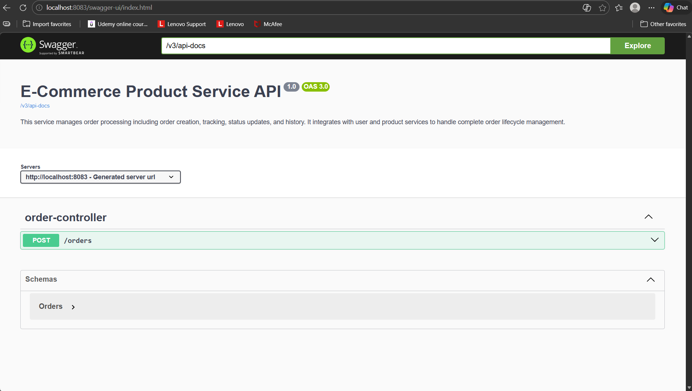
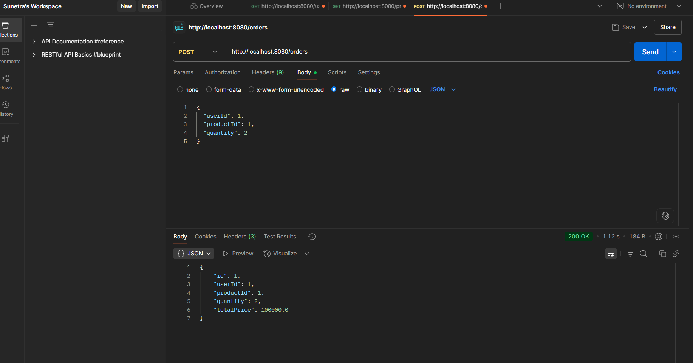
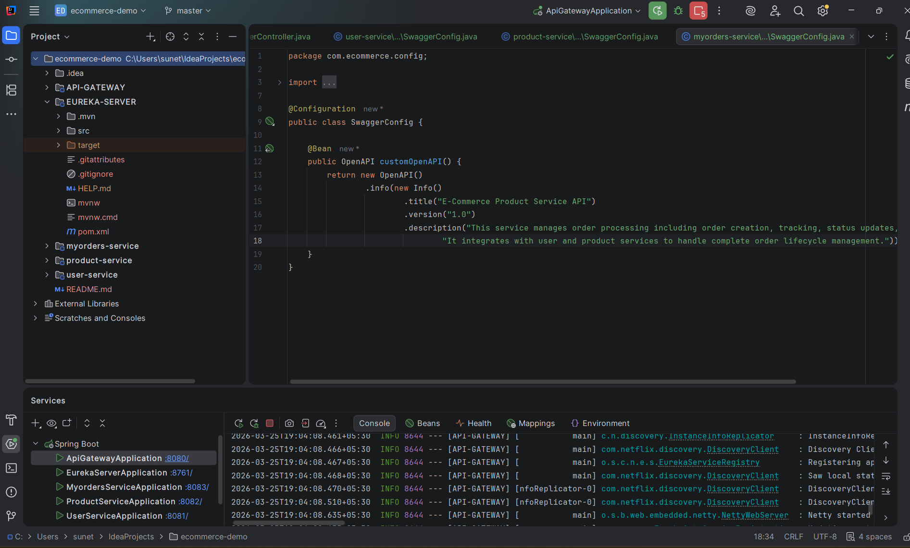
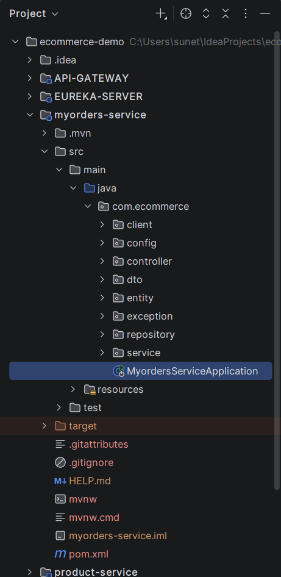

\# 🛒 E-Commerce Microservices System

A complete microservices-based backend application built using Spring Boot, following industry-standard architecture with Service Discovery and API Gateway.

\---

\## 🚀 Tech Stack

\- Java 17

\- Spring Boot

\- Spring Cloud

\- Eureka Server (Service Discovery)

\- Spring Cloud Gateway (API Gateway)

\- OpenFeign (Inter-service communication)

\- Hibernate / JPA

\- MySQL

\- Maven

\- Swagger (API Documentation)

\---

\## 🏗️ Architecture

Client → API Gateway → Microservices → Database

\- Eureka Server for service discovery

\- API Gateway for routing

\- Feign Client for inter-service communication

\---

\## 🔧 Microservices

| Service | Port | Description |

|--------|------|------------|

| Eureka Server | 8761 | Service registry |

| API Gateway | 8080 | Routing layer |

| User Service | 8081 | User management |

| Product Service | 8082 | Product management |

| Order Service | 8083 | Order processing |

\---

\## 🔄 Flow

1\. Create User

2\. Create Product

3\. Place Order

4\. Order Service calls User \& Product using Feign

5\. Total price calculated and stored

\---

\## 🌐 API Endpoints (via Gateway)

\### User

POST /users  

GET /users  

\### Product

POST /products  

GET /products  

\### Order

POST /orders  

\---

\## 🧪 Sample Request

POST /users

{

&#x20; "name": "Sunetra",

&#x20; "email": "sun@gmail.com",

&#x20; "address": "123 Shaniwar Peth, Pune"

}

POST /products

{

&#x20; "name": "Laptop",

&#x20; "price": 20000,

&#x20; "stock": 5

}

POST /orders

{

&#x20; "userId": 1,

&#x20; "productId": 1,

&#x20; "quantity": 2

}

\---

\## 📸 Screenshots

\- Eureka Dashboard

\- Swagger UI

\- Postman Response

\- Project Structure

\---

\## ⚙️ Setup Instructions

1\. Clone repo

2\. Create MySQL databases:

&#x20;  - user\_db

&#x20;  - product\_db

&#x20;  - order\_db

3\. Run services in order:

&#x20;  - Eureka Server

&#x20;  - User Service

&#x20;  - Product Service

&#x20;  - Order Service

&#x20;  - API Gateway

4\. Test APIs via:

&#x20;  http://localhost:8080

\---

\## ✨ Key Features

\- Microservices architecture

\- Service discovery using Eureka

\- API Gateway routing

\- OpenFeign client communication

\- Database per service

\- Layered architecture

\- Exception handling

\- Swagger documentation

\---

\## 🎯 Future Enhancements

\- Business rules for services

\- Dockerization

\- JWT Authentication

\- Circuit Breaker (Resilience4j)

\- AWS Deployment

\---

\## 👩‍💻 Author

Sunetra Jamkhedkar

